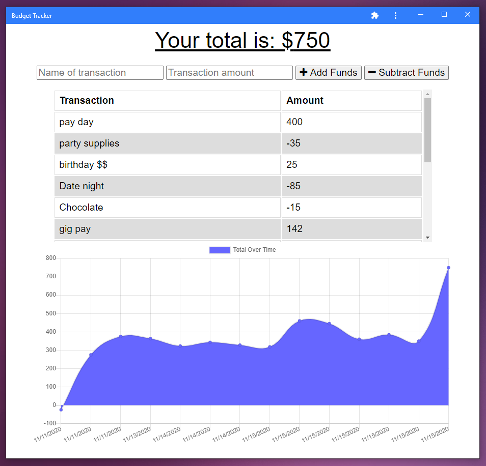

# Travel Budgeter
  
  

  A PWA budget tracking app so you can track your income and expenses on the go, with or without internet.

  ## Table of Contents
  * [**Description**](#description)
  * [**Installation**](#installation)
  * [**Usage**](#usage)
  * [**Contributing**](#contributing)
  * [**Tests**](#tests)
  * [**License**](#license)
  * [**Questions**](#questions)

  ## Description
  This repository contains files for a workout logging app. A fully functional Progressive Web Application, this program can be saved to the user's desktop or mobile phone as any other app. Functionality is guaranteed online or offline by saving the user's input through MongoDB and cloud-based Atlas when online, and defaulting to saving to the browser's IndexedDB when offline, caching the request and adding it to the Atlas database when refreshed with internet connection. 

  Deployed at: https://radiant-fjord-74338.herokuapp.com/

  Repository: https://github.com/LindseyM20/travel-budgeter-2.0

  ## Installation
  Commands to run to install dependencies: npm install

  ## Usage
  To use this program as a web application, simply visit the deploy link. To use it as a desktop or mobile app, follow [these instructions](https://medium.com/progressivewebapps/how-to-install-a-pwa-to-your-device-68a8d37fadc1). To run locally, clone this repo, run 'npm i', and then run with 'npm start'.

  
  

  ## Contributing
  [Contributor Covenant Code of Conduct](https://www.contributor-covenant.org/version/2/0/code_of_conduct/code_of_conduct.md)

  ## Tests
  Command to run tests: N/A

  ## License
  The contents of this repository are protected under the Unlicense

  ## Questions
  Follow me on GitHub at https://github.com/LindseyM20

  Please contact me with any questions or feedback at lindsey.bordner@gmail.com 

